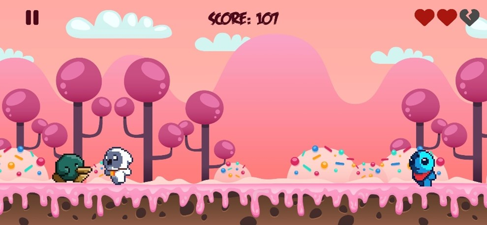
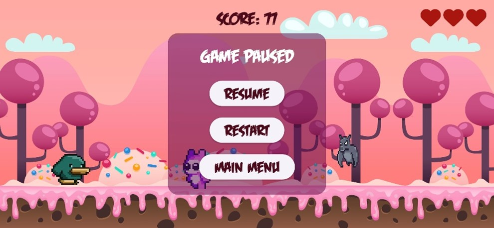
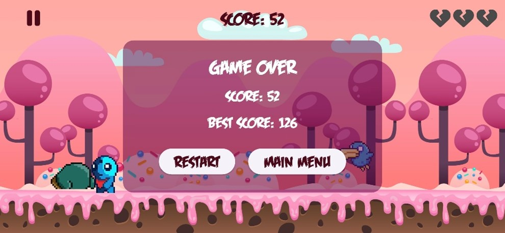

# Jino Game

My first android game project.

A simple **Endless Runner** game built with **Flutter** and **Flame Engine**.   

---

## Features
- Character can jump or crawl to avoid obstacles  
- Enemies spawning from the right side of the screen  
- Score system with increasing difficulty over time  
- Background music and sound effects using Flame Audio  
- Modular code structure (separate managers for score and difficulty)  

---

## Technologies
- [Flutter](https://flutter.dev/)  
- [Flame Engine](https://flame-engine.org/) (version 1.28.1)  
- [Flame Audio](https://pub.dev/packages/flame_audio)  

---

## How to Run
1. Clone the repository:
   ```
   git clone https://github.com/Saaghaar/Jino_game.git
   ```

2. Navigate into the project folder:
    ```
    cd Jino_game
    ```

3. Install dependencies:
    ```
    flutter pub get
    ```

4. Run the game:
    ```
    flutter run
    ```
    
## Screenshots








---

## Developer
- [**Saghar**](https://github.com/Saaghaar)

---

## Notes
- Tested on: Samsung Galaxy A55 (Android 15)  
